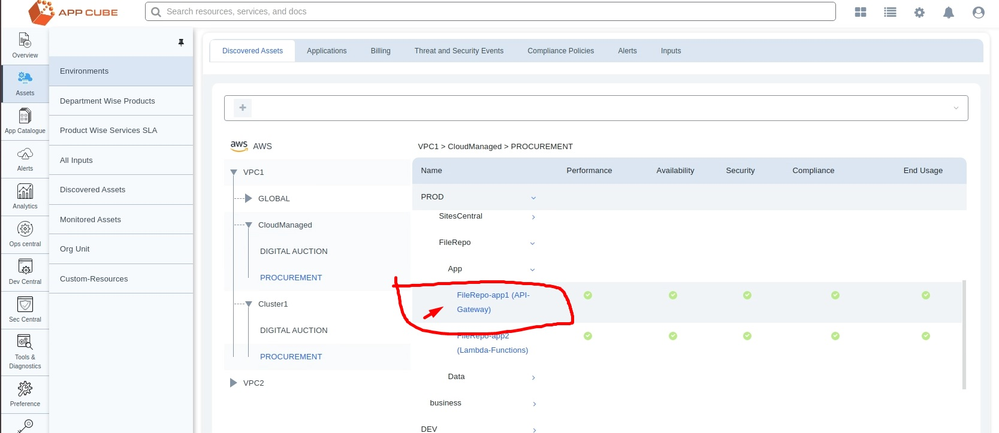
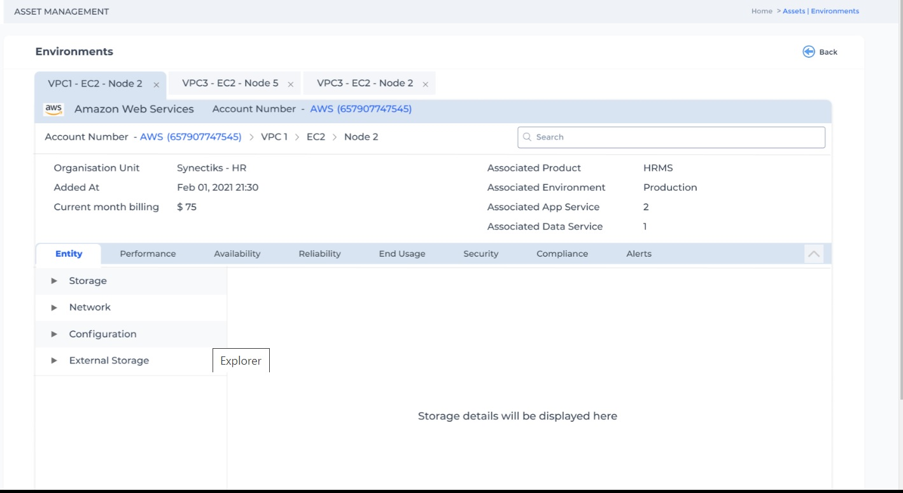
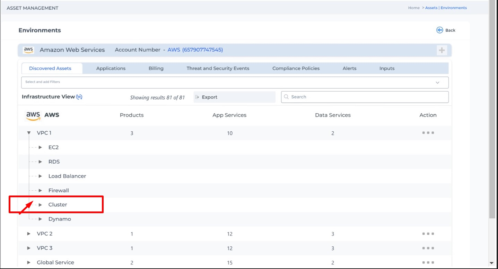
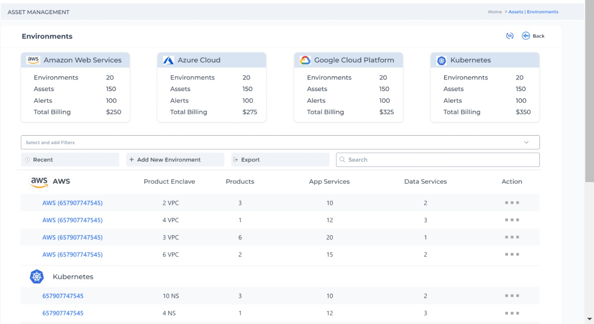
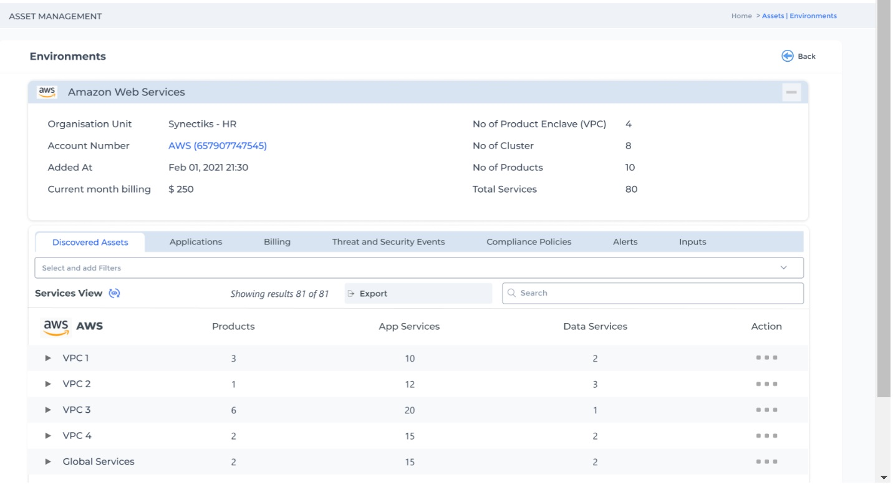
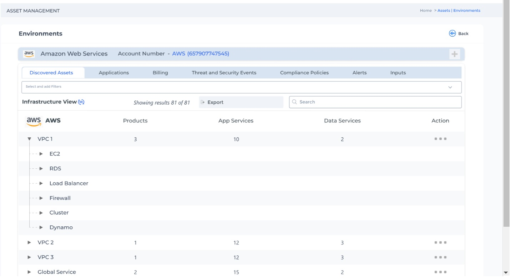
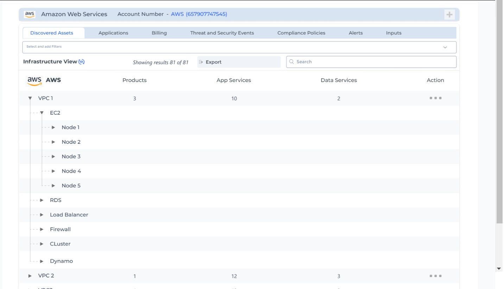

- [Introduction](#introduction)
- [Required-Code-Changes](#required-code-changes)
# Introduction
This document will detail about the aproach we take in phase1 to implement the basic SRE functionalities.
In Phase1 , we wanted to leverage the existing grafana functionalities and write the custom grafana functionalities to implement our features. In phase2 , we will gradually refactor the codebase and will write more independent modules.

please refer to the diagrams below for phase1 and phase2 architecture:
### phase1- architecture

### phase2- architecture

# Phase1 Aproach

## Terminology --

**SUI** - Our Stand Alone react based UI

**AWS Cloud Explorer** -- This service will take every AWS account ID as context and will show all the cloud 
elements (WAF / APIGw / CDN / S3 / Route53 / VPC -> EKS/ ECS / EC2 / RDS / Dynamo /.. ) for the account and their element details.

Please refer the design details of AWS explorer as below:

[AWSExplorer](https://www.figma.com/proto/tmzdMgCegtVSQLVgHR6uc3/Netlifi-Usecase-file?page-id=0%3A1&node-id=37%3A16358&viewport=184%2C-681%2C0.04&scaling=scale-down&starting-point-node-id=37%3A16358&show-proto-sidebar=1)  - Shows Cloud ELement Details 

**Service Explorer** -- This will  show  details of all the individual cloud elements 
(WAF / APIGw / CDN / S3 / Route53 / VPC -> EKS/ ECS / EC2 / RDS / Dynamo /.. ). 

**Cluster Explorer** -- This will  show  details of all the individual Cluster elements 
(products / services). 

**AWS-API-Server** -- For collecting all the elements data , AWS Cloud Explorer will call the api server.

**Appkube-Catalogue** --  This service will have all the published dashboards / tools etc 

**Appkube-cmdb** -- This service  will have the App / Data services details along with their topology details

# Process Flow
**proposed approach1**
SUI will call the cmdb api's to show every cloud accounts details. The information will be shown as below:
CMDB will have API for all the Data.

When a user clicks on any AWS account id , SUI will call the CMDB provided Api's and will draw the topology of 
every product enclaves,i.e  the elements(clusters/ firewall / Load Balancers / Nodes / Databases / Other services) 
inside the product enclaves as follows:

Screens for any accountId navigation :

SUI will call the API's as follows:

https://cmdb.synectiks.net/getAllCloudElements/? LandingZone=3534545454 

https://cmdb.synectiks.net/getProductEnclaves/? LandingZone=3534545454

https://cmdb.synectiks.net/getCloudElementsInProductEnclave/? LandingZone=3534545454 && ProductEnclave= 435454

https://cmdb.synectiks.net/getClusterElements/? LandingZone=3534545454 && ProductEnclave= 435454 && ClusterId=657667

***what to do for the clusters inside product enclaves ??***

When a user will navigate till any cluster inside the product enclave,and click on them , it will open the **Cluster explorer** from the reomte grafana.

The detail design of the cluster explorer will be published in figma.

### ***How do we do it technically ??***

From SUI, whenever we will navigate to any individual cluster and click for detail, SUI  will call the grafana instance  of the cluster as follows:

https://cluster1.synectiks.net/ 

SUI will collect the cluster URL from cmdb (CMDB has the cluster URL for each cluster)

Later on(phase 2) we will address this with proxy.

***what to do for the App and Data services inside product enclaves that comes from cloud itself (cloud managed)??***

    

    

When a user will navigate till any App and Data Services of the the product modules ,
and click on them , it will open the **service explorer** from the reomte grafana inside the cluster.

### ***How do we do it technically ??***

SUI will call the service explorer as follows:

https://cluster1.synectiks.net/rds-explorer/? DEPT=HR && PROD=HRMS && ENV=PROD && MODULE=Admission Service=RDS-postgresql

Then the corresponding grafana App (rds-explorer) will be served as headless UI and it will be renedered inside the iframe in SUI.

## ***what to do for the App and Data services inside cluster??***

When a user will navigate till any App and Data Services of the the product modules ,
and click on them , it will open the **service explorer** from the reomte grafana.

### ***How do we do it technically ??***

SUI will call the service explorer as follows:

https://grafana.synectiks.net/rds-explorer/? DEPT=HR && PROD=HRMS && ENV=PROD && MODULE=Admission Service=RDS-postgresql

Then the corresponding grafana App (rds-explorer) will be served as headless UI and it will be renedered inside the iframe in SUI.

**proposed approach2**

SUI 
    -> Cloudexplorer (Its a view for every account)

    -> CloudServiceExplorer (its a view inside grafana)

    -> ClusterExplorer (Its a diffrent URL for every cluster)

    -> ClusterServiceExplorer -- It will be a view inside that cluster grafana url)

awsexplorer will maintain views for every account and each of App and Data Services, like as below:

aws-112234344-explorer

For App and Data Services explorer --

aws-112234344-prod-env-app1-explorer

aws-112234344-prod-env-data1-explorer

There would be many views that will be retained inside awsexplorer database , say we have HRMS and LOGISTIC prducts and for their PROD env , 

HR-PROD-BusinessService1-Data1  and LOGISTICS-PROD-BusinessService1-Data2, two RDS instance is there.

awsexplorer will maintian two views as follows:

aws-112234344-HR-PROD-BusinessService1-Data1-explorer

aws-112234344-LOGISTICS-PROD-BusinessService1-Data2-explorer

Each of the views will be a composure of few dashboards, say d1/d2/d3/d4.

This dasboards will have variables - say var1.

For RDS / Dynamo , this variables will be the ARN of the databases.

Whenever inside CMDB , we will add any product and its services , proxy API will create this view inside 
awsexplorer database with their variable being associated with the ARN of the RDS/Dynamo etc.

So , 
aws-112234344-HR-PROD-BusinessService1-Data1-explorer ( var1=ARN1)
aws-112234344-LOGISTICS-PROD-BusinessService1-Data2-explorer(var1=ARN2 )

So from SUI , wehn we click enable monitoring for any services , SUI will call a API to awsexplorer 

/createView/ ? Accid=112234344 & PROD=HR & ENV=PROD & ELEMENT=RDS & ARN=arn1 & logLocation="some path"

awsexplorer will implement the createView algorithm as follows:

        Get the view template ( view is the composure of diffrent dashboards that collect metric / log data)
        for the AccId , get the right datasource and replace the datasource in the view
        replace the ARN for metric data collection
        replace the log location for log data collection
        store the new view in database with proper naming convention, and update the view table.

For those cloud elements , where there is no single ARN , say for s3 and lambdas, where for a app and data 
service, multiple S3 bucket or multiple lambdas will be there , SUI , will call createView api as follows

/createViewWithoutArn/ ? Accid=112234344 & PROD=HR & ENV=PROD & ELEMENT=LAMBDA

awsexplorer will implement the createView algorithm as follows:

            Get the template view 
            for the AccId , get the right datasource and replace the datasource in the view
            Set the variable for PROD and ENV
            The query that gets fired to datasource will have prod and env and business service
            store the new view in database with proper naming convention, and update the view table.

Inside AWS datasource we need to implement this kind of queries where corresponding to product/env / business service , we will get list of s3 buckets or lambda API's.

# Required Api's

|API | Description | Input | Output |
|:---|:---|:---|:---|
|/enableMonitoring/{elementId} | enable the monitoring for that cloud element| elementId in CMDB |  return success or failure code|
|/enableAlerts/{elementId} | enable the monitoring for that cloud element | elementId in CMDB |  return success or failure |
|/createInput/{accountId}/?inputType=cloudWatchAPi & dataType = metrics | create the api based metric type input for a accounId | aws accountId |  return success or failure |
|/createInput/{accountId}/?inputType=cloudWatchAPi & dataType = log | create the api based log type input for a accounId | aws accountId |  return success or failure |
|/createInput/{accountId}/?inputType=promethus & dataType = metric | create the api based log type input for a accounId | aws accountId |  return success or failure |
|/setLogLocation/{elementId}/?ElementType=EC2 | set the log location for the EC2 machine | EC2 machine id |  return success or failure |
|/setLogLocation/{elementId}/?ElementType=RDS | set the log location for the RDS db | RDS id |  return success or failure |
|/elementExplorer? ElementType=EC2 & PROD= HRMS & ENV =PROD & SERVICE = Admission & Ec2Id= 53545 | Open the EC2 explorer for a specific EC2 element | EC2 id or ARN |  return success or failure |
|/elementExplorer? ElementType=RDS & PROD= HRMS & ENV =PROD & SERVICE = Admission & rdsId= 55646 | Open the RDS explorer for a specific RDS element | EC2 id or ARN |  return success or failure |

# Api's Algorithm
## enableMonitoring
We could take two aproaches --
1. Create dynamic views for every element and store inside the cmdb database, the underlying algo is :

    - From Catalogues filter all the Dashbooards available for that element
    - Check the dashboards (Performance / Availability...) with available Inputs and if there are matching inputs(datasources), import those dashboards by replacing the DS and ARN.

2. Create grafana plugin App for every element and call them with ARN and log location as follows:

/elementsExplorer?   Accid=112234344 & ElementType=EC2 & PROD= HRMS & ENV =PROD & SERVICE = Admission & Ec2Id= 53545 & logLocation="some path"

/elementsExplorer/ ? Accid=112234344 & ElementType=RDS & PROD=HRMS & ENV=PROD & SERVICE = Admission  & ARN=arn1 & logLocation="some path"

Every elmentExplorer App plugin will have the variables 
    Var accId , Var ElementType , Var PRODUCT , Var ENV , Var Service , Var Arn , Var Loglocation

# Required Code Changes

**UI Changes**
 - headless view API
 - when we call /elementsExplorer/ ? Accid=112234344 & ElementType=RDS & PROD=HRMS & ENV=PROD & SERVICE = Admission  & ARN=arn1 & logLocation="some path", plugin variables gets set properly

 - element explorer App plugin that opens with the variable being set from the URL parameters
 - A datasource plugin  that takes AccId / Product / ENV / SVC and return metric / log / api data

 - Write explorer for WAF / APiGw / RDS / DYNAMO / S3 / Lambda....

 **Dashboard.js** - Futuristics

**API Changes**

    - datasource plugin  API implementation ( Accid / Prod / Env / SVC / ElementType / Arn or NoArn / Query ) -- (AwsApi / Aws-metric / Aws-logs)

