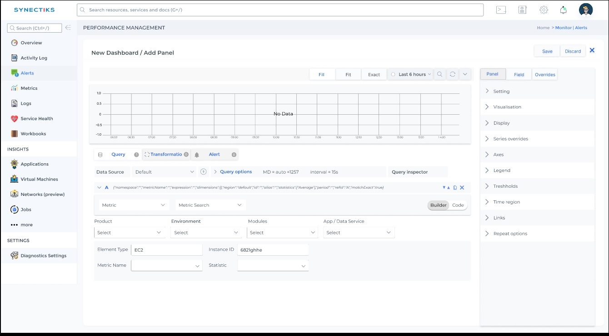

- [Introduction](#introduction)
- [Required-Code-Changes](#required-code-changes)
# Introduction
This document will detail about the aproach we take in phase1 to implement the basic SRE functionalities.
In Phase1 , we wanted to leverage the existing grafana functionalities and write the custom grafana functionalities to implement our features. In phase2 , we will gradually refactor the codebase and will write more independent modules.

please refer to the diagrams below for phase1 and phase2 architecture:
### phase1- architecture

### phase2- architecture

# Phase1 Aproach

## Terminology --
---

### **SUI** - Our Stand Alone react based UI
---

The UI will mostly call cmdb api and will show different clouds and their element details:

Please refer the design details of AWS explorer as below:

[AWSExplorer](https://www.figma.com/proto/tmzdMgCegtVSQLVgHR6uc3/Netlifi-Usecase-file?page-id=0%3A1&node-id=37%3A16358&viewport=184%2C-681%2C0.04&scaling=scale-down&starting-point-node-id=37%3A16358&show-proto-sidebar=1)  - Shows Cloud ELement Details 

Whenever SUI  will show any specific App and Data Service Details, it will call the service explorer from remote grafana and render in iframe.

---

### **AWS Cloud Element Explorer** -- 

The purpose of this service is to render the explorer for every App and Data Services in cloud. This service is a remote grafana that has a inbuilt ***Cloud Datasource*** . This service will have explorer for all cloud elements (WAF / APIGw / CDN / S3 / Route53 / VPC -> EKS/ ECS / EC2 / RDS / Dynamo /.. ).

This remote grafana instance will either keep grafana Apps or Appkube Views for cloud elements(to be decided)

For any App or Data services , SUI will call the remote grafana url with parameters and display the results in iframe in phase1.

Phase2 , SUI will do only api calls and render directly in UI via proxy grafana API's server.
---

### **Cluster Explorer** -- This will  show  details of all the individual Cluster elements 
(products / services). 

---

### **Service Explorer** -- This will  show  details of all the individual cloud elements 
(WAF / APIGw / CDN / S3 / Route53 / VPC -> EKS/ ECS / EC2 / RDS / Dynamo /.. ). 

Theere would be two aproaches to display the services belong to cluster or cloud managed.

---

### **AWS-API-Server** -- For collecting all the elements data , AWS Cloud Explorer will call the api server.
---

### **Appkube-Catalogue** --  This service will have all the published dashboards / tools etc 

---

### **Appkube-cmdb** -- This service  will have the App / Data services details along with their topology details
---

# Process Flow

SUI will call the cmdb api's to show every cloud accounts details. The information will be shown as below:

CMDB will have API for all the Data.

When a user clicks on any AWS account id , SUI will call the CMDB provided Api's and will draw the topology of every product enclaves,i.e  the elements(clusters/ firewall / Load Balancers / Nodes / Databases / Other services)  inside the product enclaves as follows:

Screens for any accountId navigation :

SUI will call the API's as follows:

https://cmdb.synectiks.net/getAllCloudElements/? LandingZone=3534545454 

https://cmdb.synectiks.net/getProductEnclaves/? LandingZone=3534545454

https://cmdb.synectiks.net/getCloudElementsInProductEnclave/? LandingZone=3534545454 && ProductEnclave= 435454

https://cmdb.synectiks.net/getClusterElements/? LandingZone=3534545454 && ProductEnclave= 435454 && ClusterId=657667

## Cluster Explorer Navigation

***what to do for the clusters inside product enclaves ??***

When a user will navigate till any cluster inside the product enclave,and click on them , it will open the **Cluster explorer** from the reomte grafana.

The detail design of the cluster explorer will be published in figma.

### ***How do we do it technically ??***

From SUI, whenever we will navigate to any individual cluster and click for detail, SUI  will call the grafana instance  of the cluster as follows:

https://cluster1.synectiks.net/ 

SUI will collect the cluster URL from cmdb (CMDB has the cluster URL for each cluster)

Later on(phase 2) we will address this with proxy.

## Cluster Managed Services Explorer Navigation

***what to do for the App and Data services inside product enclaves that comes from cloud itself (cloud managed)??***

When a user will navigate till any App and Data Services of the the product modules ,and click on them , it will open the **service explorer** from the reomte grafana inside the cluster.

### ***How do we do it technically ??***

SUI will call the service explorer as follows:

https://cluster1.synectiks.net/rds-explorer/? DEPT=HR && PROD=HRMS && ENV=PROD && MODULE=Admission Service=RDS-postgresql

Then the corresponding grafana App (rds-explorer) will be served as headless UI and it will be renedered inside the iframe in SUI.

## Cloud Managed Services Explorer Navigation

## ***what to do for the App and Data services that are managed by cloud itself??***

When a user will navigate till any App and Data Services of the the product modules ,and click on them , it will open the **service explorer** from the reomte grafana.

### ***How do we do it technically ??***

SUI will call the service explorer as follows:

https://grafana.synectiks.net/rds-explorer/? DEPT=HR && PROD=HRMS && ENV=PROD && MODULE=Admission Service=RDS-postgresql

Then the corresponding grafana App (rds-explorer) will be served as headless UI and it will be renedered inside the iframe in SUI.

# How to implement Service Explorer 
## ***Proposed approach1***

* SUI->  
    * -> CloudServiceExplorer { its a app (that has many dashboards with variable) inside the grafana (which is maintained for all cloud accounts)} 
    * -> ClusterExplorer (Its a diffrent grafana URL for every cluster) 
    * -> ClusterServiceExplorer -- It will be a App (that has many dashboards with variable) inside that cluster grafana url )

## How to develop Service Explorer in this aproach

We will write grafana App for each explorer. Each App will be created with a mix of different dashboards and each dashboards will have the following variables:

PRODUCT / ENVIRONMENT / MODULE / SERVICE

SUI will call the element explorer (say RDS explorer)

http://grafana.synectiks.net/a/rds-explorer-app?orgId=1&var-product=HRMS&var-env=production&var-module=admission&var-service=rds-postgresql&from=now-24h&to=now

SUI can know from the elementData , what sort of explorer need to be called , say for Ec2 machine , ec2-explorer,
for RDS-potgresql database, it will call rds-postgresql explorer.

### How the backend of DataSource will be implemented? 
 

---
### How developers will create the dashboards that will be used in element explorer App? 
 

---

Developers can select the product , environment , module , App/Data service details in datasource query.

The datasource frontend ui can call the CMDB api to know the element type( Node / RDS / Dynamo etc) and its 
unique id.

The Datasouce UI should fire the Metrics/ Log / Trace / Api  queries with parameters (product , environment , module , App/Data service) 

The Datasource backend will fetch the query response as follows:

* For the (product , environment , module , App/Data service) combination , get the landing zone (Aws Account Id) for the service.
* For the landing zone , get credentials(role arn) etc from vault service and initailize the sdk credential.
* For EC2 / RDS  etc where we query with unique instance id , we wil find the element type and id from the CMDB api.
    * In case of Lambda , where for a particular App service, we run multiple lambdas , we will find the list of
    lambda functions for the (product , environment , module , App service) combination and issue the query for those lambdas.
* Then we will fire the query with the dimension being equated with instanceId or RDS id or Dynamo table etc

## ***Proposed approach2***

* SUI->  
    * -> CloudServiceExplorer { its a view mainatined for each sepcific element (that has many dashboards with instanceId) inside the grafana (which is maintained for all cloud accounts)} 
    * -> ClusterExplorer (Its a diffrent grafana URL for every cluster) 
    * -> ClusterServiceExplorer -- It will be a view (that has many dashboards with instanceId) inside that cluster grafana url )

awsexplorer will maintain views for every account and each of App and Data Services, like as below:

aws-112234344-explorer

For App and Data Services explorer --

aws-112234344-prod-env-app1-explorer

aws-112234344-prod-env-data1-explorer

There would be many views that will be retained inside awsexplorer database , say we have HRMS and LOGISTIC prducts and for their PROD env , 

HR-PROD-BusinessService1-Data1  and LOGISTICS-PROD-BusinessService1-Data2, two RDS instance is there.

awsexplorer will maintian two views as follows:

aws-112234344-HR-PROD-BusinessService1-Data1-explorer

aws-112234344-LOGISTICS-PROD-BusinessService1-Data2-explorer

Each of the views will be a composure of few dashboards, say d1/d2/d3/d4.

This dasboards will have variables - say var1.

For RDS / Dynamo , this variables will be the ARN of the databases.

Whenever inside CMDB , we will add any product and its services , proxy API will create this view inside 
awsexplorer database with their variable being associated with the ARN of the RDS/Dynamo etc.

So , 
aws-112234344-HR-PROD-BusinessService1-Data1-explorer ( var1=ARN1)
aws-112234344-LOGISTICS-PROD-BusinessService1-Data2-explorer(var1=ARN2 )

So from SUI , wehn we click enable monitoring for any services , SUI will call a API to awsexplorer 

/createView/ ? Accid=112234344 & PROD=HR & ENV=PROD & ELEMENT=RDS & ARN=arn1 & logLocation="some path"

awsexplorer will implement the createView algorithm as follows:

        Get the view template ( view is the composure of diffrent dashboards that collect metric / log data)
        for the AccId , get the right datasource and replace the datasource in the view
        replace the ARN for metric data collection
        replace the log location for log data collection
        store the new view in database with proper naming convention, and update the view table.

For those cloud elements , where there is no single ARN , say for s3 and lambdas, where for a app and data 
service, multiple S3 bucket or multiple lambdas will be there , SUI , will call createView api as follows

/createViewWithoutArn/ ? Accid=112234344 & PROD=HR & ENV=PROD & ELEMENT=LAMBDA

awsexplorer will implement the createView algorithm as follows:

            Get the template view 
            for the AccId , get the right datasource and replace the datasource in the view
            Set the variable for PROD and ENV
            The query that gets fired to datasource will have prod and env and business service
            store the new view in database with proper naming convention, and update the view table.

Inside AWS datasource we need to implement this kind of queries where corresponding to product/env / business service , we will get list of s3 buckets or lambda API's.

# Required Api's

|API | Description | Input | Output |
|:---|:---|:---|:---|
|/enableMonitoring/{elementId} | enable the monitoring for that cloud element| elementId in CMDB |  return success or failure code|
|/enableAlerts/{elementId} | enable the monitoring for that cloud element | elementId in CMDB |  return success or failure |
|/createInput/{accountId}/?inputType=cloudWatchAPi & dataType = metrics | create the api based metric type input for a accounId | aws accountId |  return success or failure |
|/createInput/{accountId}/?inputType=cloudWatchAPi & dataType = log | create the api based log type input for a accounId | aws accountId |  return success or failure |
|/createInput/{accountId}/?inputType=promethus & dataType = metric | create the api based log type input for a accounId | aws accountId |  return success or failure |
|/setLogLocation/{elementId}/?ElementType=EC2 | set the log location for the EC2 machine | EC2 machine id |  return success or failure |
|/setLogLocation/{elementId}/?ElementType=RDS | set the log location for the RDS db | RDS id |  return success or failure |
|/elementExplorer? ElementType=EC2 & PROD= HRMS & ENV =PROD & SERVICE = Admission & Ec2Id= 53545 | Open the EC2 explorer for a specific EC2 element | EC2 id or ARN |  return success or failure |
|/elementExplorer? ElementType=RDS & PROD= HRMS & ENV =PROD & SERVICE = Admission & rdsId= 55646 | Open the RDS explorer for a specific RDS element | EC2 id or ARN |  return success or failure |

# Api's Algorithm
## enableMonitoring
We could take two aproaches --
1. Create dynamic views for every element and store inside the cmdb database, the underlying algo is :

    - From Catalogues filter all the Dashbooards available for that element
    - Check the dashboards (Performance / Availability...) with available Inputs and if there are matching inputs(datasources), import those dashboards by replacing the DS and ARN.

2. Create grafana plugin App for every element and call them with ARN and log location as follows:

/elementsExplorer?   Accid=112234344 & ElementType=EC2 & PROD= HRMS & ENV =PROD & SERVICE = Admission & Ec2Id= 53545 & logLocation="some path"

/elementsExplorer/ ? Accid=112234344 & ElementType=RDS & PROD=HRMS & ENV=PROD & SERVICE = Admission  & ARN=arn1 & logLocation="some path"

Every elmentExplorer App plugin will have the variables 
    Var accId , Var ElementType , Var PRODUCT , Var ENV , Var Service , Var Arn , Var Loglocation

# Required Code Changes

**UI Changes**
 - headless view API
 - when we call /elementsExplorer/ ? Accid=112234344 & ElementType=RDS & PROD=HRMS & ENV=PROD & SERVICE = Admission  & ARN=arn1 & logLocation="some path", plugin variables gets set properly

 - element explorer App plugin that opens with the variable being set from the URL parameters
 - A datasource plugin  that takes AccId / Product / ENV / SVC and return metric / log / api data

 - Write explorer for WAF / APiGw / RDS / DYNAMO / S3 / Lambda....

 **Dashboard.js** - Futuristics

**API Changes**

    - datasource plugin  API implementation ( Accid / Prod / Env / SVC / ElementType / Arn or NoArn / Query ) -- (AwsApi / Aws-metric / Aws-logs)

# CMDB Population 

We wil add product/env/modules/ (App & Data) services metadata inside Appkube platform from the UI (manually) where the product and Env is not created from the Appkube automation Engine. Every product/env  will have association with Departments. Unless a full fledge UI is developed and we have the capability to add environments / modules / app & Data services inside modules, we can have them imported through a JSON     

# Different Table Structure

## Cloud_Element 
This table will hold all the discovered cloud elements for any specific AWS account.

|Column Name | Description | type | Format-Example|
|:---|:---|:---|:---|
|id | id of the element | int |unique id |
|elementType | Type of the service it belongs | string | EC2/EKS/ECS/LAMBDA/RDS....|
|cloudIdentity | The ARN or any unique identity for the resource|jsonb | [JSONlink](./jsons/Cloud_Element/identity.json)|
|hardwareLocation| Which account and which VPC does it belong | jsonb |[JSONlink](./jsons/Cloud_Element/hardwareLocation.json)|
|hostedServices| Which business and common services it hosts | jsonb |[JSONlink](./jsons/Cloud_Element/hostedServices.json)|
|SLA| Its calculated SLA scores | jsonb |[JSONlink](./jsons/Cloud_Element/sla.json)|
|COST| Its calculated Cost| jsonb |[JSONlink](./jsons/Cloud_Element/cost.json)|
|VIEW| All the Dashboards that is associated with the element | jsonb |[JSONlink](./jsons/Cloud_Element/view.json)|
|CONFIG| Element Config Json  | jsonb |[JSONlink](./jsons/Cloud_Element/config.json)|
|COMPLIANCE| ELement Compliance Json | jsonb |[JSONlink](./jsons/Cloud_Element/compliance.json)|

## Snapshot of Cloud_Element  table

|id |elementType | cloudIdentity | hardwareLocation | hostedServices | SLA | Cost | VIEW | CONFIG | COMPLIANCE|
|:---|:---|:---|:---|:---|:---|:---|:---|:---|:---|
|1234 | EKS |[JSONlink](./jsons/Cloud_Element/identity.json) | [JSONlink](./jsons/Cloud_Element/hardwareLocation.json) |[JSONlink](./jsons/Cloud_Element/hostedServices.json)|SLAJSON|COSTJSON | VIEWJSON | CONFIGJSON |COMPLIANCEJSON|
|1235 | ECS |[JSONlink](./jsons/Cloud_Element/identity.json) | [JSONlink](./jsons/Cloud_Element/hardwareLocation.json) |[JSONlink](./jsons/Cloud_Element/hostedServices.json)|SLAJSON|COSTJSON | VIEWJSON | CONFIGJSON |COMPLIANCEJSON|
|1236 | EC2 |[JSONlink](./jsons/Cloud_Element/identity.json)| [JSONlink](./jsons/Cloud_Element/hardwareLocation.json) |[JSONlink](./jsons/Cloud_Element/hostedServices.json)|SLAJSON|COSTJSON | VIEWJSON | CONFIGJSON |COMPLIANCEJSON|
|1237 | LAMBDA |[JSONlink](./jsons/Cloud_Element/identity.json)| [JSONlink](./jsons/Cloud_Element/hardwareLocation.json) |[JSONlink](./jsons/Cloud_Element/hostedServices.json)|SLAJSON|COSTJSON | VIEWJSON | CONFIGJSON |COMPLIANCEJSON|
|1238 | RDS |[JSONlink](./jsons/Cloud_Element/identity.json)| [JSONlink](./jsons/Cloud_Element/hardwareLocation.json) |[JSONlink](./jsons/Cloud_Element/hostedServices.json)|SLAJSON|COSTJSON | VIEWJSON | CONFIGJSON |COMPLIANCEJSON|
|1239 | DYNAMO |[JSONlink](./jsons/Cloud_Element/identity.json)| [JSONlink](./jsons/Cloud_Element/hardwareLocation.json) |[JSONlink](./jsons/Cloud_Element/hostedServices.json)|SLAJSON|COSTJSON | VIEWJSON | CONFIGJSON |COMPLIANCEJSON|
|1241 | ApiGw |[JSONlink](./jsons/Cloud_Element/identity.json)| [JSONlink](./jsons/Cloud_Element/hardwareLocation.json) |[JSONlink](./jsons/Cloud_Element/hostedServices.json)|SLAJSON|COSTJSON | VIEWJSON | CONFIGJSON |COMPLIANCEJSON|
|1242 | NLB |[JSONlink](./jsons/Cloud_Element/identity.json)| [JSONlink](./jsons/Cloud_Element/hardwareLocation.json) |[JSONlink](./jsons/Cloud_Element/hostedServices.json)|SLAJSON|COSTJSON | VIEWJSON | CONFIGJSON |COMPLIANCEJSON|
|1243 | OpenSearch |[JSONlink](./jsons/Cloud_Element/identity.json)| [JSONlink](./jsons/Cloud_Element/hardwareLocation.json) |[JSONlink](./jsons/Cloud_Element/hostedServices.json)|SLAJSON|COSTJSON | VIEWJSON | CONFIGJSON |COMPLIANCEJSON|
|1244 | CacheDB |[JSONlink](./jsons/Cloud_Element/identity.json)| [JSONlink](./jsons/Cloud_Element/hardwareLocation.json) |[JSONlink](./jsons/Cloud_Element/hostedServices.json)|SLAJSON|COSTJSON | VIEWJSON | CONFIGJSON |COMPLIANCEJSON|

## Micro_Services
This table will hold all the discovered cloud elements for any specific AWS account.

|Column Name | Description | type | Format-Example|
|:---|:---|:---|:---|
|id | id of the service | int |unique id |
|name | name of the service | string |unique |
|department | department it belongs | string |unique |
|product | product of the service | string |unique |
|environment | environment of the service | string |unique |
|serviceType | Type of the service it belongs | string | Business ,Common  |
|serviceTopology| how its composed of Gw/LB/AppLayer/DataLayer| jsonb |[JSONlink](./jsons/Micro_Service/serviceTopology.json)|
|SLA| Its calculated SLA scores | jsonb |[JSONlink](./jsons/Cloud_Element/sla.json)|
|COST| Its calculated Cost| jsonb |[JSONlink](./jsons/Cloud_Element/cost.json)|
|VIEW| All the Dashboards that is associated with the element | jsonb |[JSONlink](./jsons/Cloud_Element/view.json)|
|CONFIG| Element Config Json  | jsonb |[JSONlink](./jsons/Cloud_Element/config.json)|
|COMPLIANCE| ELement Compliance Json | jsonb |[JSONlink](./jsons/Cloud_Element/compliance.json)|

## Snapshot of Micro_Services table

|id |Name| Department |  Product | Environment | serviceType |serviceTopology| SLA | Cost | VIEW | CONFIG | COMPLIANCE|
|:---|:---|:---|:---|:---|:---|:---|:---|:---|:---|:---|:---|
|1255 | Admission |HR |HRMS|PROD| BUSINESS|[JSONlink](./jsons/Micro_Service/serviceTopology.json) |SLAJSON|COSTJSON | VIEWJSON | CONFIGJSON |COMPLIANCEJSON|

## organization
This table will hold organization information.

|Column Name | Description | type | Format-Example|
|:---|:---|:---|:---|
|id | organization id | int |unique id |
|name | organization name | string |unique |

## Snapshot of organization table

|id |name| 
|:---|:---|
|1 | Synectiks |

## department
This table will hold department information.

|Column Name | Description | type | Format-Example|
|:---|:---|:---|:---|
|id | department id | int |unique id |
|name | department name | string |unique |
|organization_id | forign key organization table | int | integer id |

## Snapshot of department table

|id |name|organization_id|  
|:---|:---|:---|
|1 | Human Resource | 1|
|2 | IT Networking | 1|

## cloud_environment
This table will hold cloud wise account and its cross role information.

|Column Name | Description | type | Format-Example|
|:---|:---|:---|:---|
|id | cloud environment id | int |unique id |
|department_id | forign key organization table | int |integer |
|description | description | string |  |
|account_id | cloud(AWS/AZURE/GCP ect.) account id | string |  |
|display_name | name given to any account | string |  |
|role_arn | cross account role arn | string |  |
|external_id | external id of an account | string |  |
|cloud | cloud name (AWS/AZURE/GCP) | string |  |

## Snapshot of cloud_environment table

|id |department_id|description|account_id|display_name|role_arn|external_id|cloud|  
|:---|:---|:---|:---|:---|:---|:---|:---|
|1 | 1 | AWS account for for Human Resource department|7869574624|HRD Account|arn:aws:iam::7869574624:role/CrossAccount|abcdqwe|AWS|

## cloud_element_summary
This table will have summary of an account.

|Column Name | Description | type | Format-Example|
|:---|:---|:---|:---|
|id | cloud element id | int |unique id |
|cloud_environment_id | forign key cloud_environment table | int |integer |
|summary_json | JSON having compelte summanry of an account | jsonb |  |

## Snapshot of cloud_element_summary table

|id |cloud_environment_id|summary_json|  
|:---|:---|:---|
|1 | 1 | [JSONlink](./jsons/Cloud_Element_Summary/summary.json)|

## deployment_environment
This table will have summary of an account.

|Column Name | Description | type | Format-Example|
|:---|:---|:---|:---|
|id | environment id | int |unique id |
|name | environment name | string |unique |

## Snapshot of deployment_environment table

|id |name|  
|:---|:---|
|1 | DEV |
|2 | TEST |
|3 | STAGE |
|4 | PROD |

## catalogue
This table will hold dev/sec/ops dashboards and datasource master datas.

|Column Name | Description | type | Format-Example|
|:---|:---|:---|:---|
|id | catalogue id | int |unique id |
|details | dev/sec/ops datasource and dashboards master data | jsonb | |

## Snapshot of catalogue table

|id |details|  
|:---|:---|
|1 | [JSONlink](./jsons/Catalogue/catalogue.json) |

# CMDB API End Points
## Base API : http://localhost:5057/api

## Organization
| method | end point | Request | Response | Description | 
|:---|:---|:---|:---|:---|
|GET | /organizations | | [Response JSONlink](./jsons/Organization/all.json) | Get all the rows|
|GET | /organizations/{id} | | [Response JSONlink](./jsons/Organization/entity.json) | Get single row of given id |
|GET | /organizations/search | name=Synectiks | [Response JSONlink](./jsons/Organization/all.json) | Get all the rows on given filter|
|POST | /organizations | [Request JSONlink](./jsons/Organization/add.json) | [Response JSONlink](./jsons/Organization/entity.json) | Create a record|
|PATCH | /organizations/{id} | [Request JSONlink](./jsons/Organization/update.json) | [Response JSONlink](./jsons/Organization/entity.json) | Update a record|
|DELETE | /organizations/{id} | | | Delete a record|

## Department
| method | end point | Request | Response | Description | 
|:---|:---|:---|:---|:---|
|GET | /departments | | [Response JSONlink](./jsons/Department/all.json) | Get all the rows|
|GET | /departments/{id} | | [Response JSONlink](./jsons/Department/entity.json) | Get single row of given id |
|GET | /departments/search | name=IT Networki | [Response JSONlink](./jsons/Department/all.json) | Get all the rows on given filter|
|POST | /departments | [Request JSONlink](./jsons/Department/add.json) | [Response JSONlink](./jsons/Department/entity.json) | Create a record|
|PATCH | /departments/{id} | [Request JSONlink](./jsons/Department/update.json) | [Response JSONlink](./jsons/Department/entity.json) | Update a record|
|DELETE | /departments/{id} | | | Delete a record| 

## Cloud Environment
| method | end point | Request | Response | Description | 
|:---|:---|:---|:---|:---|
|GET | /cloud-environments | | [Response JSONlink](./jsons/CoudEnvironment/all.json) | Get all the rows|
|GET | /cloud-environments/{id} | | [Response JSONlink](./jsons/CoudEnvironment/entity.json) | Get single row of given id |
|GET | /cloud-environments/search | accountId=657907747 | [Response JSONlink](./jsons/CoudEnvironment/all.json) | Get all the rows on given filter|
|POST | /cloud-environments | [Request JSONlink](./jsons/CoudEnvironment/add.json) | [Response JSONlink](./jsons/CoudEnvironment/entity.json) | Create a record|
|PATCH | /cloud-environments/{id} | [Request JSONlink](./jsons/CoudEnvironment/update.json) | [Response JSONlink](./jsons/CoudEnvironment/entity.json) | Update a record|
|DELETE | /cloud-environments/{id} | | | Delete a record|

## Cloud Element Summary
| method | end point | Request | Response | Description | 
|:---|:---|:---|:---|:---|
|GET | /cloud-element-summary | | [Response JSONlink](./jsons/Cloud_Element_Summary/all.json) | Get all the rows|
|GET | /cloud-element-summary/{id} | | [Response JSONlink](./jsons/Cloud_Element_Summary/entity.json) | Get single row of given id |
|GET | /cloud-element-summary/search | accountId=657907747 | [Response JSONlink](./jsons/Cloud_Element_Summary/all.json) | Get all the rows on given filter|
|POST | /cloud-element-summary | [Request JSONlink](./jsons/Cloud_Element_Summary/add.json) | [Response JSONlink](./jsons/Cloud_Element_Summary/entity.json) | Create a record|
|PATCH | /cloud-element-summary/{id} | [Request JSONlink](./jsons/Cloud_Element_Summary/update.json) | [Response JSONlink](./jsons/Cloud_Element_Summary/entity.json) | Update a record|
|DELETE | /cloud-element-summary/{id} | | | Delete a record| 

## Cloud Element 
| method | end point | Request | Response | Description | 
|:---|:---|:---|:---|:---|
|GET | /cloud-elements | | [Response JSONlink](./jsons/Cloud_Element/all.json) | Get all the rows|
|GET | /cloud-elements/{id} | | [Response JSONlink](./jsons/Cloud_Element/entity.json) | Get single row of given id |
|GET | /cloud-elements/search | elementType=EC2 | [Response JSONlink](./jsons/Cloud_Element/all.json) | Get all the rows on given filter|
|POST | /cloud-elements | [Request JSONlink](./jsons/Cloud_Element/add.json) | [Response JSONlink](./jsons/Cloud_Element/entity.json) | Create a record|
|PATCH | /cloud-elements/{id} | [Request JSONlink](./jsons/Cloud_Element/update.json) | [Response JSONlink](./jsons/Cloud_Element/entity.json) | Update a record|
|DELETE | /cloud-elements/{id} | | | Delete a record| 

## Micro Service 
| method | end point | Request | Response | Description | 
|:---|:---|:---|:---|:---|
|GET | /micro-service | | [Response JSONlink](./jsons/Micro_Service/all.json) | Get all the rows|
|GET | /micro-service/{id} | | [Response JSONlink](./jsons/Micro_Service/entity.json) | Get single row of given id |
|GET | /micro-service/search | name=Admission&product=HR | [Response JSONlink](./jsons/Micro_Service/all.json) | Get all the rows on given filter|
|GET | /micro-service/enable-monitoring | name=Admission&product=HR | [Response JSONlink](./jsons/Micro_Service/enableMonitoring.json) | import all the dashboards for the services searched on given filter criteria |
|POST | /micro-service | [Request JSONlink](./jsons/Micro_Service/add.json) | [Response JSONlink](./jsons/Micro_Service/entity.json) | Create a record|
|PATCH | /micro-service/{id} | [Request JSONlink](./jsons/Micro_Service/update.json) | [Response JSONlink](./jsons/Micro_Service/entity.json) | Update a record|
|DELETE | /micro-service/{id} | | | Delete a record|  

## Deployment Environment 
| method | end point | Request | Response | Description | 
|:---|:---|:---|:---|:---|
|GET | /deployment-environments | | [Response JSONlink](./jsons/DeploymentEnvironment/all.json) | Get all the rows|
|GET | /deployment-environments/{id} | | [Response JSONlink](./jsons/DeploymentEnvironment/entity.json) | Get single row of given id |
|GET | /deployment-environments/search | elementType=EC2 | [Response JSONlink](./jsons/DeploymentEnvironment/all.json) | Get all the rows on given filter|
|POST | /deployment-environments | [Request JSONlink](./jsons/DeploymentEnvironment/add.json) | [Response JSONlink](./jsons/DeploymentEnvironment/entity.json) | Create a record|
|PATCH | /deployment-environments/{id} | [Request JSONlink](./jsons/DeploymentEnvironment/update.json) | [Response JSONlink](./jsons/DeploymentEnvironment/entity.json) | Update a record|
|DELETE | /deployment-environments/{id} | | | Delete a record|

## Catalogue 
| method | end point | Request | Response | Description | 
|:---|:---|:---|:---|:---|
|GET | /catalogue | | [Response JSONlink](./jsons/Catalogue/catalogue.json) | Get all the rows|
|GET | /catalogue/{id} | | [Response JSONlink](./jsons/Catalogue/catalogue.json) | Get single row of given id |
|POST | /catalogue | [Request JSONlink](./jsons/Catalogue/catalogue.json) | [Response JSONlink](./jsons/Catalogue/catalogue.json) | Create a record|
|PATCH | /catalogue/{id} | [Request JSONlink](./jsons/Catalogue/catalogue.json) | [Response JSONlink](./jsons/Catalogue/catalogue.json) | Update a record|
|DELETE | /catalogue/{id} | | | Delete a record|
|GET | /catalogue/datasource/{id} | | [Response JSONlink](./jsons/Catalogue/datasource/entity.json) | Get a datasource|
|GET | /catalogue/datasource/search | name=AWS-PullMetric-Api | [Response JSONlink](./jsons/Catalogue/datasource/all.json) | Get list of datasources on given filter|
|POST | /catalogue/datasource | [Request JSONlink](./jsons/Catalogue/datasource/add.json) | [Response JSONlink](./jsons/Catalogue/datasource/entity.json) | create a datasource|
|PATCH | /catalogue/datasource/{id} | [Request JSONlink](./jsons/Catalogue/datasource/update.json) | [Response JSONlink](./jsons/Catalogue/datasource/entity.json) | Update a datasource|
|GET | /catalogue/dasbhoard/{id} | | [Response JSONlink](./jsons/Catalogue/dashboard/entity.json) | Get a dashboard|
|GET | /catalogue/dasbhoard/search | associatedSLAType=PERFORMANCE | [Response JSONlink](./jsons/Catalogue/dashboard/all.json) | Get list of dashboards on given filter|
|POST | /catalogue/dashboard | [Request JSONlink](./jsons/Catalogue/dashboard/add.json) | [Response JSONlink](./jsons/Catalogue/dashboard/entity.json) | create a dashboard|
|PATCH | /catalogue/dashboard/{id} | [Request JSONlink](./jsons/Catalogue/dashboard/update.json) | [Response JSONlink](./jsons/Catalogue/dashboard/entity.json) | Update a dashboard| 

### **Please verify entity checklist -**

- Organization
- Department 
- Product
- Environment
- MicroServices (GW/LB/App/Data Layers)
- Cloud Element (cluster/ cloud-managed elements / global elements / gateway elements)
- Landing Zones
- Product Enclaves
- Artifact Catalogue
- Artifacts
- Library
- Automation-Jobs
- ToolChains
- Service Cost & Quaity Trend 
- Process Cost & Quality Trend

## **Please verify the metadata checklists :**

App_Services_Type -- 
Like NodesJs / Golang / Java / Python Api Server / Lambda / StepFunction / Batch

Data_Services_Type
SQLDB (Mysql/Mssql/Postgresql) , CacheDB(Redis/Memcache) , SearchDB(Opensearch/ ElasticSearch) , NOSQL DB (Mongo/ Dynamo ), GRAPH DB , METRIC DB , LOG DB , Object Store(S3) , Github 

Data stored as follows:

Mysql    	SQLDB
Mssql    	SQLDB
Postgresql 	SQLDB
Redis		CacheDB
MemCache 	CacheDB
HazzleCast      CacheDB
ElasticSearch   SearchDB
OpenSearch      SearchDB
Dynamo		NOSQL DB
Mongo		NOSQL DB

Master ENVTYPE -- DEV/TEST/STAGE/PROD

## **Please give endpoints for the following Queries --**

For every Organization --

    - Its department , products , products environment , associated landing Zones and Product Enclaves 
    - Department wise product and services Cost & SLA's 
    - Landing Zone Wise Costs 

For every landing Zones --

    - How Many AWS services Elements it has - Product Enclaves/ Global / Gateway Services / Clusters / Serverles / Nodes / Databases / Datalake services
    - How many products / envs it hosts?
    - How many Micro-Services its hosts , which product / env they belong
    - Its available ApiGateways/LB's/ Product Enclaves / Clusters/ Service Mesh / Cloud Managed Services (With filters of Data(Cache / SQL / NOSQL ..) & DataLake  Services) 

For every Product Enclaves --

    - How many clusters ? 
    - Each cluster hosted App & Data Layer , which microservices they belong?

For every Product --

    - How many environment it has ?
    - List the MicroServices for that Env
    - List the Api Gateway / LB for that Env

For every Microservices --

    - What are their Gateway / Lb / App / Data Layer
    - Find the Cost & SLA's of the Microservice
    - Find the Cost & SLA's of their Gateway / Lb / App / Data Layer
    - Find the Cost & SLA's  trending of the Microservice
    - Find the Cost & SLA's trending of their Gateway / Lb / App / Data Layer
    - Find the compliance of its Gateway / Lb / App / Data Layer

Find the Cost(daily/weekly/monthly) of the entire organization

    - Department Wise Cost
    - Product Wise Cost 
    - Environment Wise Cost
    - Department/ Product  wise Costs
    - Department/ Product / Environemnt wise Costs
    - Department/ Product / Environemnt / Microservice Wise Costs

Find the SLA's (daily/weekly/monthly) of the entire organization

    - Department/ Product / Environemnt wise CostsSLA's
    - Department/ Product / Environemnt / Microservice Wise SlA's
    - Department/ Product / Environemnt / Microservice/ (Gw/LB/App/Data layer) Wise SlA's

## **Please give endpoints for the following Provisioning --**

For every cloudelement

    - Set the log / Trace Location
    - Set the cost & SLA 

For every Microservices 

    - Set/update the topology (GW/LB/APP/DATA)
    - Set the cost & SLA 
    - Set the dependent Microservices

For every organization / department 

    - Add landing Zone

For every Landing Zone ---

    - Add product enclave (WAF / Gateway / LB / VPC/ Few Clusters )
    - Add cluster in product enclave
    - Add WAF/Gateway/LB/product enclave / Cluster for a particular product env
    - Add product(specifying its env) in product enclave
    - Add Business Service in a product
    - Add Common Service in a product
    - Run Audits on Product
    - Run Audits on Landing Zone
    - Run Audits on Product Enclave
    - Run Audits on Cluster

